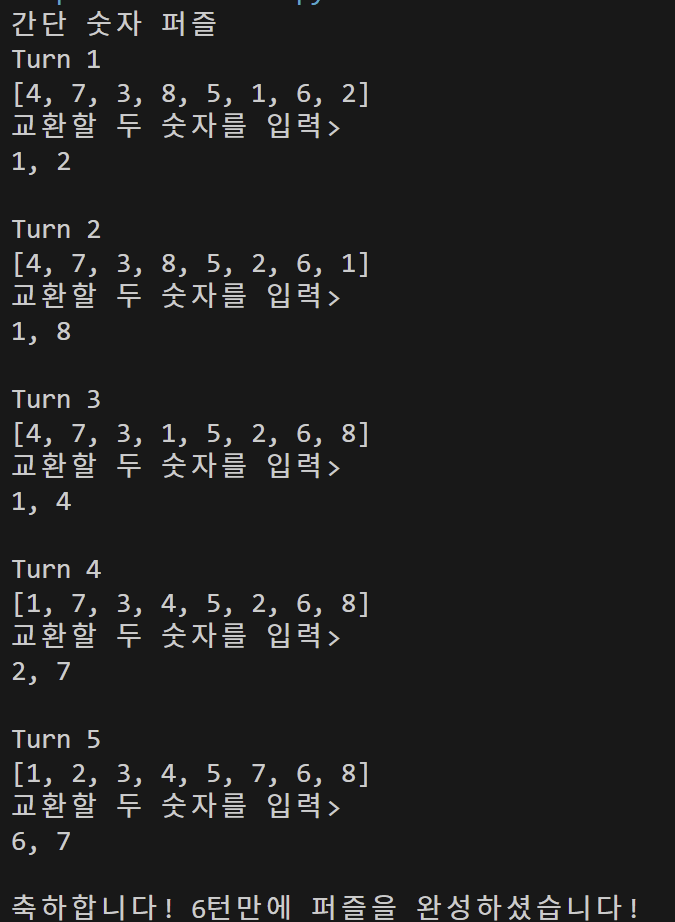
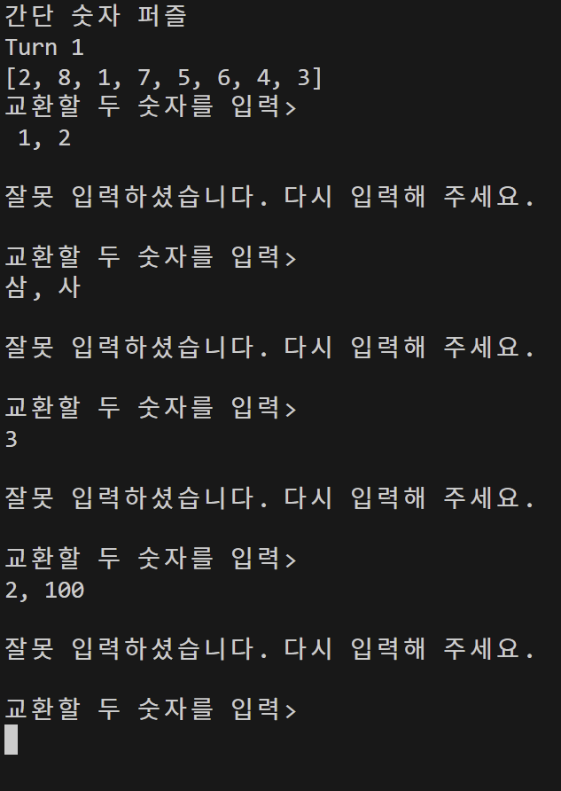

# 1단계: 1차원 숫자 퍼즐 구현하기

## 풀이 과정 및 코드 설명

### 1. 실행시 배열이 랜덤으로 배치되어야 하므로 random 라이브러리를 사용하여 numbers에 배치
```
import random

numbers = list(range(1,9))
random.shuffle(numbers)
```

### 2. Turn, flag, arr 변수를 사용
```
flag = 1
turn = 1
arr = [1,2,3,4,5,6,7,8]
```

flag는 에러 처리를 위해 사용
turn은 턴으로 처리
arr은 기존 로직과 비교를 위해 사용

### 3. 기능 구현
print("간단 숫자 퍼즐")

    while True:
    
    if arr == numbers:
        print(f"축하합니다! {turn}턴만에 퍼즐을 완성하셨습니다!")
        break

    if flag == 1:
        print(f"Turn {turn}")
        print(numbers)
        print("교환할 두 숫자를 입력>")
        nums = input()
        print()
        check(nums)

    elif flag == 0:
        print("교환할 두 숫자를 입력>")
        nums = input()
        print()
        check(nums)

flag가 0이면 배열과 Turn을 출력하지 않는다.
또한 성공시 반복 종료가 됩니다.

### 4. 에러 처리
1. 맨 앞이 공백인 경우
2. 숫자가 아닌 한글이 입력된 경우
3. 범위를 초과한 경우
4. 입력이 하나인 경우

```
def check(nums):

    global flag, turn
    try:  
        num1, num2 = map(str, nums.split(','))
        if nums.startswith(" "):
            print("잘못 입력하셨습니다. 다시 입력해 주세요.")
            print()
            flag = 0
        elif int(num1) in numbers and int(num2) in numbers:
            turn += 1
            flag = 1
            index1 = numbers.index(int(num1))
            index2 = numbers.index(int(num2))
            numbers[index1], numbers[index2] = numbers[index2], numbers[index1]
        else:
            print("잘못 입력하셨습니다. 다시 입력해 주세요.")
            print()
            flag = 0
    except ValueError:
        print("잘못 입력하셨습니다. 다시 입력해 주세요.")
        print()
        flag = 0
```

## 실행 결과
### 성공


### 실패

